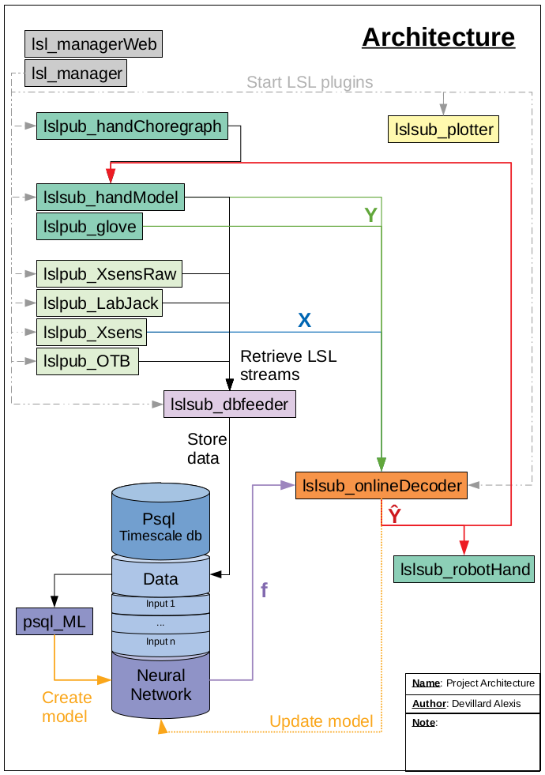

# tne_project

| [Inputs](#inputs)  | [Inputs Labels](#inputs-labels)   | [Database](#database)  | [Processing ](#processing) | [Other](#other) |
|:------------------:|:---------------------------------:|:----------------------:|:--------------------------:|:---------------:|
| [OTB](#OTB)        | [Hand Model](#handModel)          | [Feeder](#dbfeeder)    |  |  | 
| [ESP](#ESP)        | [Hand Choregraph](#handChoregraph)| [Machine learning](#ML)|  |  | 
| [LabJack](#LabJack)| [Sensor Glove](#handGlove)        |  |  |  | 
| [Xsens](#Xsens)    |  |  |  |  | 

## Inputs
### OTB400 - lslpub_OTB 
- **Brief**: Create a TCP connection with the OTB400 device and publish the samples on a LSL streams.
- **Documentation & Git**: [Doc link](https://aightech.github.io/lslpub_OTB/html/d3/dcc/md__r_e_a_d_m_e.html) & [Git link](https://github.com/Aightech/lslpub_OTB)
- **Note**: /
- **Compatibility**:

| Ubuntu           | Window10         | MacOS            |
|:----------------:|:----------------:|:----------------:|
|:heavy_check_mark:|:heavy_check_mark:|:grey_question:   |

### ESP - lslpub_ESP 
- **Brief**: Create a wifi connection with an ESP device and publish the samples on a LSL streams.
- **Documentation & Git**: [Doc link](https://aightech.github.io/lslpub_ESP/html/index.html) & [Git link](https://github.com/Aightech/lslpub_ESP)
- **Note**: /
- **Compatibility**:

| Ubuntu           | Window10         | MacOS            |
|:----------------:|:----------------:|:----------------:|
|:heavy_check_mark:|:grey_question:   |:grey_question:   |

### LabJack - lslpub_LabJack 
- **Brief**: Create a TCP connection with the LabJack and publish the samples on a LSL streams.
- **Documentation & Git**: ~~[Doc link](https://aightech.github.io/lslpub_LabJack/html/index.html)~~ & [Git link](https://github.com/Aightech/lslpub_LabJack)
- **Note**: not stable and not configurable.
- **Compatibility**:

| Ubuntu           | Window10         | MacOS            |
|:----------------:|:----------------:|:----------------:|
|:heavy_check_mark:|:grey_question:   |:grey_question:   |

### Xsens Raw IMU - lslpub_XsensRaw 
- **Brief**: Connect to Xsens IMU devices and publish the samples on a LSL streams.
- **Documentation & Git**: ~~[Doc link](https://aightech.github.io/lslpub_XsensRaw/html/index.html)~~ & [Git link](https://github.com/Aightech/lslpub_XsensRaw)
- **Note**: not stable.
- **Compatibility**:

| Ubuntu           | Window10         | MacOS            |
|:----------------:|:----------------:|:----------------:|
|:heavy_check_mark:|:grey_question:   |:grey_question:   |

## Inputs Labels
### Hand Model - lslsub_handModel 
- **Brief**: Create two 3D hand models with Unity. Those models can be control through LSL streams and they publish they current position on others LSL streams. 
- **Documentation & Git**: [Doc link](https://aightech.github.io/lslpub_handModel/html/index.html) & [Git link](https://github.com/Aightech/lslpub_handModel)
- **Note**: Linux issue due to LSL4Unity plugins
- **Compatibility**:

| Ubuntu           | Window10         | MacOS            |
|:----------------:|:----------------:|:----------------:|
|:x:               |:heavy_check_mark:|:grey_question:   |

### Hand Choregrapher - lslpub_handChoregraph 
- **Brief**: Create or open hand choregraphy file and publish the succession of mouvement on a LSL stream to control the [hand model](#handModel).
- **Documentation & Git**: [Doc link](https://aightech.github.io/lslpub_handChoregraph/html/index.html) & [Git link](https://github.com/Aightech/lslpub_handChoregraph)
- **Note**: /
- **Compatibility**:

| Ubuntu           | Window10         | MacOS            |
|:----------------:|:----------------:|:----------------:|
|:heavy_check_mark:|:heavy_check_mark:|:grey_question:   |

### Sensors Glove - lslpub_handGlove 
- **Brief**: Create a serial connection with the glove device device and publish the samples on a LSL streams.
- **Documentation & Git**: ~~[Doc link](https://aightech.github.io/lslpub_handGlove/html/index.html)~~ & [Git link](https://github.com/Aightech/lslpub_handGlove)
- **Note**: not working well ...
- **Compatibility**:

| Ubuntu           | Window10         | MacOS            |
|:----------------:|:----------------:|:----------------:|
|:heavy_check_mark:|:grey_question:   |:grey_question:   |

## Database
### Database Feeder - lslsub_dbfeeder 
- **Brief**: Search for available LSL stream, for each of them create a thread doing the following: open the database, create a table and store the samples.
- **Documentation & Git**: [Doc link](https://aightech.github.io/lslsub_dbfeeder/html/index.html) & [Git link](https://github.com/Aightech/lslsub_dbfeeder)
- **Note**: /
- **Compatibility**:

| Ubuntu           | Window10         | MacOS            |
|:----------------:|:----------------:|:----------------:|
|:heavy_check_mark:|:grey_question:   |:grey_question:   |

### Machine learning - psql_ML 
- **Brief**: Get inputs and labels samples from the database and train a tensorflow model.
- **Documentation & Git**: [Doc link](https://aightech.github.io/psql_ML/html/index.html) & [Git link](https://github.com/Aightech/psql_ML)
- **Note**: /
- **Compatibility**:

| Ubuntu           | Window10         | MacOS            |
|:----------------:|:----------------:|:----------------:|
|:heavy_check_mark:|:heavy_check_mark:|:grey_question:   |

## Processing
### Online Decoder - lslsub_decoder 
- **Brief**: Get inputs and labels samples from the lsl streams and train a tensorflow model online.
- **Documentation & Git**: [Doc link](https://aightech.github.io/lslsub_decoder/html/index.html) & [Git link](https://github.com/Aightech/lslsub_decoder)
- **Note**: Not done yet
- **Compatibility**:

| Ubuntu           | Window10         | MacOS            |
|:----------------:|:----------------:|:----------------:|
|:grey_question:   |:grey_question:   |:grey_question:   |

## Other
### LSL plotter - lslsub_plotter 
- **Brief**: Get the streams and plot them in real time
- **Documentation & Git**: [Doc link](https://aightech.github.io/lslsub_plotter/html/index.html) & [Git link](https://github.com/Aightech/lslsub_plotter)
- **Note**: /
- **Compatibility**:

| Ubuntu           | Window10         | MacOS            |
|:----------------:|:----------------:|:----------------:|
|:heavy_check_mark:|:heavy_check_mark:|:grey_question:   |

### Manager Web - lsl_managerWeb 
- **Brief**: Get inputs and labels samples from the database and train a tensorflow model.
- **Documentation & Git**: [Doc link](https://aightech.github.io/lsl_managerWeb/html/index.html) & [Git link](https://github.com/Aightech/lsl_managerWeb)
- **Note**: /
- **Compatibility**:

| Ubuntu           | Window10         | MacOS            |
|:----------------:|:----------------:|:----------------:|
|:heavy_check_mark:|:heavy_check_mark:|:grey_question:   |
